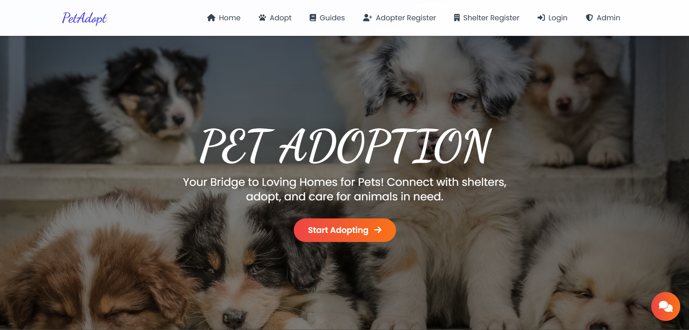
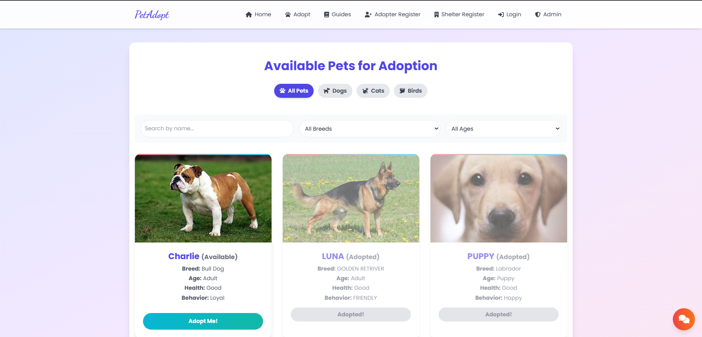
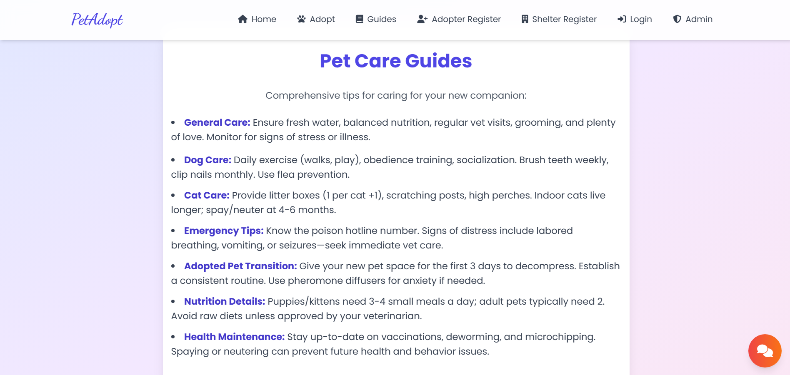
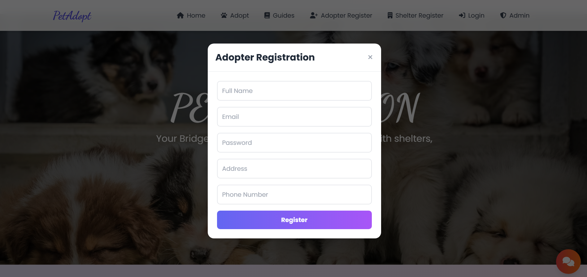
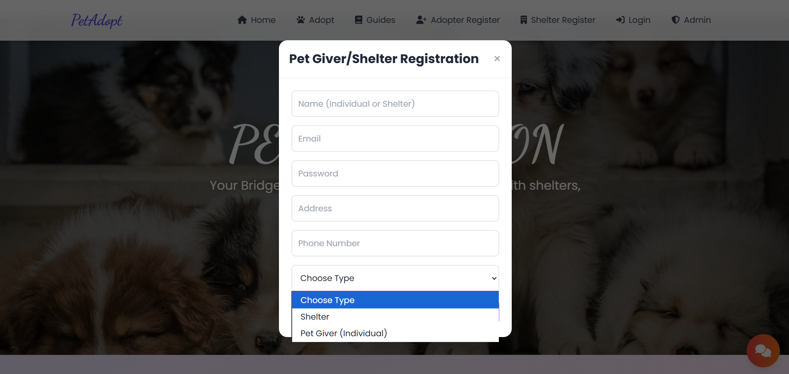
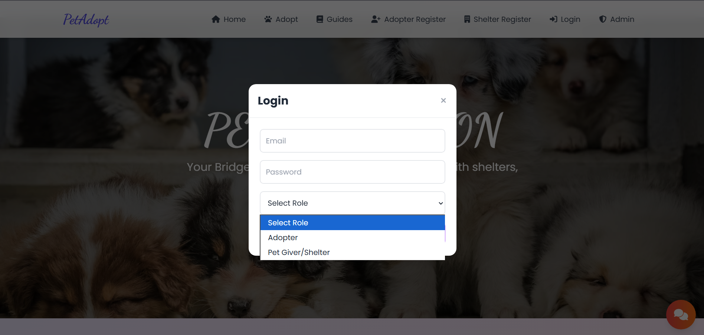
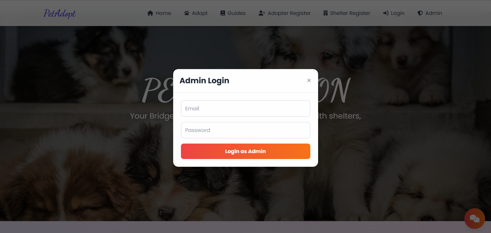
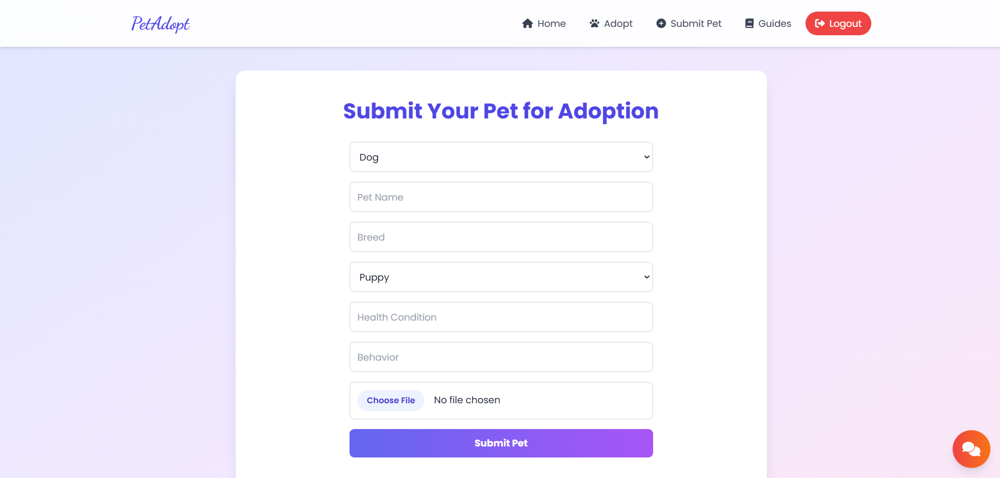
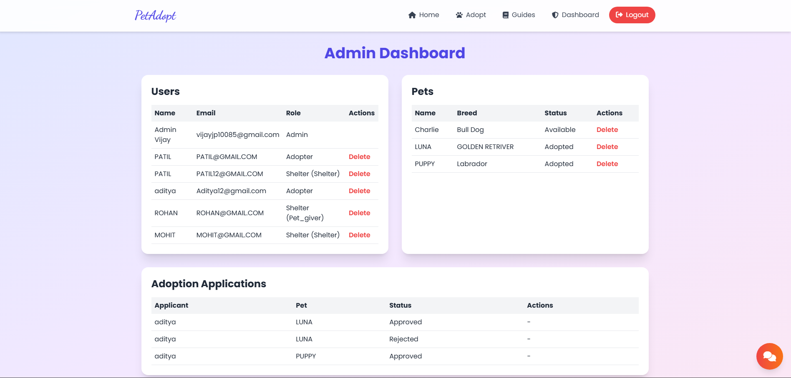

# 🐾 Pet Adoption Platform (MERN Stack)

<<<<<<< HEAD
A full-stack **Pet Adoption Platform** built using the **MERN Stack (MongoDB, Express.js, React.js, and Node.js)**. The platform enables adopters to browse and adopt pets, allows shelters to submit pets for adoption, and provides administrators with tools to manage users, pets, and adoption requests. It also includes an **AI-powered chatbot** integrated with the **Google Gemini API** to assist users with pet care guidance and adoption-related queries.
=======
A full-stack **Pet Adoption Platform** built using the **MERN Stack (MongoDB, Express.js, React.js, and Node.js)**. The platform allows users to browse pets, submit adoption requests, and enables administrators to manage pets and adoption applications. It also features an **AI-powered chatbot** integrated with the **Google Gemini API** to assist users with pet care and adoption-related queries.
>>>>>>> f14cd24f7d9b6405e2995b9998ed043d01f3d6c2

---

## 🚀 Features

- 🔐 User Registration & Login
- 🛡️ JWT Authentication & Authorization
- 🐶 Browse Available Pets
<<<<<<< HEAD
- 🔍 Search & Filter Pets
- ❤️ Submit Adoption Requests
- 🏠 Shelter Pet Submission
- 👨‍💼 Admin Dashboard
- 📷 Pet Image Upload
=======
- ❤️ Submit Adoption Applications
- 🏠 Shelter Pet Submission
- 👨‍💼 Admin Dashboard
- 📷 Image Upload Support
>>>>>>> f14cd24f7d9b6405e2995b9998ed043d01f3d6c2
- 🤖 AI Chatbot using Google Gemini API
- 📱 Responsive User Interface
- ☁️ MongoDB Atlas Integration

---

## 🛠️ Tech Stack

### Frontend
- React.js
- HTML5
- CSS3
- JavaScript

### Backend
- Node.js
- Express.js

### Database
- MongoDB Atlas
- Mongoose

<<<<<<< HEAD
### Authentication
- JWT (JSON Web Token)

=======
>>>>>>> f14cd24f7d9b6405e2995b9998ed043d01f3d6c2
### AI Integration
- Google Gemini API

### Development Tools
- Visual Studio Code
- Git
- GitHub

---

## 📂 Project Structure

<<<<<<< HEAD
```text
=======
```
>>>>>>> f14cd24f7d9b6405e2995b9998ed043d01f3d6c2
Pet-Adoption-Platform/
│
├── backend/
│   ├── config/
│   ├── controllers/
│   ├── middleware/
│   ├── models/
│   ├── routes/
│   ├── uploads/
│   ├── utils/
│   ├── package.json
│   └── server.js
│
├── frontend/
│   ├── src/
│   ├── public/
│   └── package.json
│
├── components/
├── services/
├── IMAGES/
<<<<<<< HEAD
├── Screenshots/
=======
>>>>>>> f14cd24f7d9b6405e2995b9998ed043d01f3d6c2
├── README.md
└── package.json
```

---

## ⚙️ Prerequisites

<<<<<<< HEAD
Before running the project, make sure you have installed:
=======
Before running the project, ensure you have installed:
>>>>>>> f14cd24f7d9b6405e2995b9998ed043d01f3d6c2

- Node.js (v16 or later)
- npm
- MongoDB Atlas account (or local MongoDB)
- Git

---

## 📥 Installation

<<<<<<< HEAD
### 1️⃣ Clone the Repository
=======
### 1. Clone the Repository
>>>>>>> f14cd24f7d9b6405e2995b9998ed043d01f3d6c2

```bash
git clone https://github.com/vijayjp2914/Pet-Adoption-Platform.git
cd Pet-Adoption-Platform
```

---

<<<<<<< HEAD
### 2️⃣ Backend Setup
=======
### 2. Backend Setup
>>>>>>> f14cd24f7d9b6405e2995b9998ed043d01f3d6c2

```bash
cd backend
npm install
```

<<<<<<< HEAD
Create a **.env** file inside the **backend** folder.
=======
Create a **.env** file inside the `backend` folder.
>>>>>>> f14cd24f7d9b6405e2995b9998ed043d01f3d6c2

Example:

```env
PORT=5000
MONGO_URI=your_mongodb_connection_string
JWT_SECRET=your_jwt_secret
API_KEY=your_google_gemini_api_key
```

<<<<<<< HEAD
Start the backend:
=======
Start the backend server:
>>>>>>> f14cd24f7d9b6405e2995b9998ed043d01f3d6c2

```bash
npm start
```

<<<<<<< HEAD
Backend runs at:
=======
Backend runs on:
>>>>>>> f14cd24f7d9b6405e2995b9998ed043d01f3d6c2

```
http://localhost:5000
```

---

<<<<<<< HEAD
### 3️⃣ Frontend Setup

Open a new terminal.
=======
### 3. Frontend Setup

Open a new terminal:
>>>>>>> f14cd24f7d9b6405e2995b9998ed043d01f3d6c2

```bash
cd frontend
npm install
npm start
```

<<<<<<< HEAD
Frontend runs at:
=======
Frontend runs on:
>>>>>>> f14cd24f7d9b6405e2995b9998ed043d01f3d6c2

```
http://localhost:3000
```

---

<<<<<<< HEAD
## 👤 Demo Admin Account

A demo administrator account is automatically created during the first application startup.

**Email**

```text
=======
## 👤 Admin Account

A demo administrator account is automatically created when the application starts for the first time.

Default demo credentials:

**Email**

```
>>>>>>> f14cd24f7d9b6405e2995b9998ed043d01f3d6c2
Petadmin@example.com
```

**Password**

<<<<<<< HEAD
```text
Admin@52
```

> **Note:** These credentials are intended only for local development and demonstration. Change them before deploying to production.
=======
```
Admin@52
```

> **Note:** These are development/demo credentials. Change them before deploying the application in a production environment.
>>>>>>> f14cd24f7d9b6405e2995b9998ed043d01f3d6c2

---

## 🤖 AI Chatbot

<<<<<<< HEAD
The application integrates the **Google Gemini API** to provide an AI-powered chatbot that helps users with:

- 🐶 Pet care guidance
- ❤️ Adoption-related questions
- 🩺 General pet health information
- 💡 Pet ownership tips

---

# 📸 Project Screenshots

## 🏠 Home Page



---

## 🐶 Adopt Pets



---

## 📖 Pet Care Guides



---

## 👤 Adopter Registration



---

## 🏢 Shelter Registration



---

## 🔐 User Login



---

## 🛡️ Admin Login



---

## ➕ Submit Pet



---

## 📊 Admin Dashboard


=======
The application integrates the **Google Gemini API** to provide an AI-powered chatbot that assists users with:

- Pet care guidance
- Adoption-related questions
- General pet information

---

## 📸 Screenshots

You can include screenshots of:

- 🏠 Home Page
- 🐶 Pet Listing
- ❤️ Adoption Form
- 👨‍💼 Admin Dashboard
- 🤖 AI Chatbot
>>>>>>> f14cd24f7d9b6405e2995b9998ed043d01f3d6c2

---

## 🔮 Future Enhancements

<<<<<<< HEAD
- 📧 Email Notifications
- 📅 Appointment Scheduling
- 🤖 AI Pet Recommendation System
- ✅ Online Adoption Approval Workflow
- 📊 Advanced Admin Analytics
- 🌐 Multi-language Support
- 📱 Progressive Web App (PWA)
=======
- Email Notifications
- Appointment Scheduling
- Pet Recommendation System
- Online Adoption Approval
- Admin Analytics Dashboard
- Multi-language Support
>>>>>>> f14cd24f7d9b6405e2995b9998ed043d01f3d6c2

---

## 👨‍💻 Author

**Vijay J Patil**

- GitHub: https://github.com/vijayjp2914
<<<<<<< HEAD
- LinkedIn: https://www.linkedin.com/in/vijayp2914
=======

- LinkedIn: https://www.linkedin.com/in/vijayp2914

>>>>>>> f14cd24f7d9b6405e2995b9998ed043d01f3d6c2
- Email: vijayjp10085@gmail.com

---

## 📄 License

<<<<<<< HEAD
This project was developed for educational and learning purposes.

If you found this project helpful, consider ⭐ starring the repository on GitHub!
=======
This project is developed for educational and learning purposes.
>>>>>>> f14cd24f7d9b6405e2995b9998ed043d01f3d6c2
